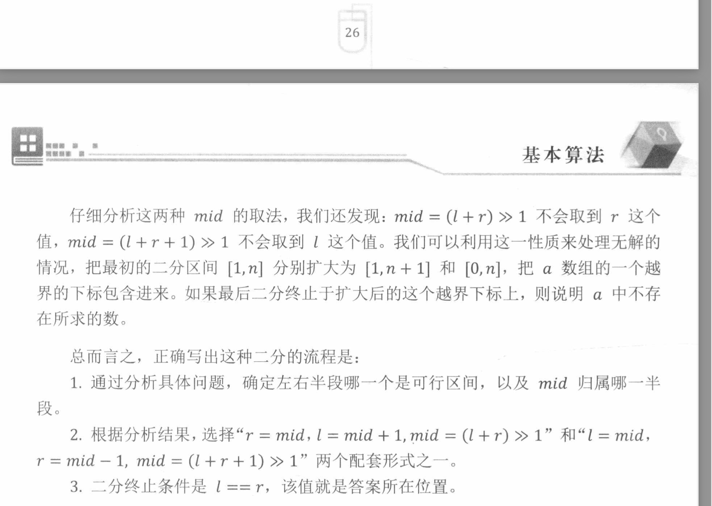

# Binary Search
## TDK binary search 二分 格式

r = mid,l =mid +1 , mid =(l+r)>>1

r = mid,l =mid -1 , mid=(l +r +1)>>1

https://leetcode-cn.com/problems/find-in-mountain-array/submissions/
如果要写成
r=mid-1 l=mid 的情况也要转变为 r=mid, l= mid +1  最后return l-1 因为值变成了l-1,
所以初始值 l,r 也应该对应加1 [contest\00000c275d69\c309\q3\t3.py](https://leetcode.cn/contest/weekly-contest-309/problems/longest-nice-subarray/)

``` python
        l,r = 2,n+1 # l,r 需要加1 因为return value减一
...
        while l <r:
            mid = (l+r)>>1
            if  verify(mid):
                l = mid+1
            else:
                r = mid 
        return l-1
```


写成 while l<r 的循环的时候，r的值最好是一个不能取的值:  #https://leetcode-cn.com/problems/maximum-number-of-removable-characters/
``` 
https://leetcode.cn/submissions/detail/242079949/

while lo < hi:
    mid =(hi+lo )>>1
    #print(mid)
    if check(p,s,mid):
        lo = mid +1
    else:
        hi=mid
return lo -1
```

https://leetcode-cn.com/problems/longest-duplicate-substring/solution/gong-shui-san-xie-zi-fu-chuan-ha-xi-ying-hae9/

l = mid, r=mid -1  , mid = (l+r+1) >>1  while l <r  

