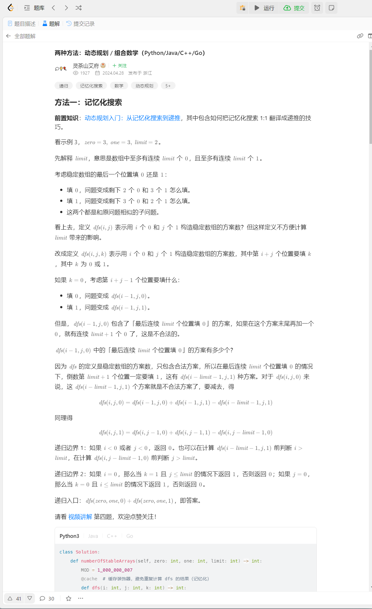

## Questin
##### https://leetcode.cn/problems/find-all-possible-stable-binary-arrays-i/description/
##### https://leetcode.cn/problems/find-all-possible-stable-binary-arrays-i/submissions/
##### contest\00000c361d112\d129\q4

## Solution

First give N^4 

```
class Solution:
    def numberOfStableArrays(self, zero: int, one: int, limit: int) -> int:
        mod = 10**9+7
        ls = []
        @cache
        def dfs(zeroleft,oneleft,oneT,zeroT):
            #print(zeroleft,oneleft,oneT,zeroT)
            if zeroleft + oneleft  == 0:
                #print(ls,oneT,zeroT)
                return 1
            if zeroleft ==0 and oneT ==0 :
                return 0
            if oneleft ==0 and zeroT==0:
                return 0
            res =0
            if zeroleft and oneT>1:
                #ls.append(0)
                res += dfs(zeroleft-1, oneleft, oneT-1,limit+1)
                #ls.pop()
            if oneleft and zeroT > 1:
                #ls.append(1)
                res += dfs(zeroleft,oneleft -1,limit+1,zeroT-1)
                #ls.pop()
            return res
                    
        return dfs(zero,one,limit+1,limit+1)%mod
```
Which will OT,
And then think last placement of 1 or 0 will affect the state 

```
class Solution:
    def numberOfStableArrays(self, zero: int, one: int, limit: int) -> int:
        mod = 10**9+7
        ls = []
        @cache
        def dfs(zeroleft,oneleft,state):
            #print(zeroleft,oneleft,oneT,zeroT)
            if zeroleft + oneleft  == 0:
                #print(ls,state)
                return 1
            if zeroleft ==0 and state>limit :
                return 0
            if oneleft ==0 and state < -limit:
                return 0
            res =0
            if zeroleft and state<limit:
                #ls.append(0)
                res += dfs(zeroleft-1, oneleft,max(state+1,1))
                #ls.pop()
            if oneleft and state > -limit:
                #ls.append(1)
                res += dfs(zeroleft,oneleft -1,min(-1,state-1))
                #ls.pop()
            return res%mod
                    
        return dfs(zero,one,0)%mod
```

Then the complicity will be O(N^3) 

which will also OT and OOM

The DP need to be O(2*N^2) and the transtion state will like:

##### https://leetcode.cn/problems/find-all-possible-stable-binary-arrays-ii/solutions/2758868/dong-tai-gui-hua-cong-ji-yi-hua-sou-suo-37jdi/



NewStateEndwithOne = OldStateEndwithZero + OldStateEndwithOne  - InvalidStateWithlimit+1Ones
DP(i,j,1)     = DP(i,j-1,0)              + DP(i,j-1,1)         - DP(i,j-limit-1,0)

如果limit是1

DP(i,j,1) = DP(i,j-1,0) + DP(i,j-1,1) - DP(i,j-2,0)
明显DP(i,j-1,1) 是不能存在的状态，如果DP(i,j-2,0)状态是合法状态，则DP(i,j-1,1)是和DP(i,j-1,1)也是合法状态，二则是相等的

如果limit是2
DP(i,j,1) = DP(i,j-1,0) + DP(i,j-1,1) -DP(i,j-3,0)

为什么不能直接去除 DP(i,j-limit,1) ,因为j-limit 等于0的时候，就不可能出现DP(i,0,1)的状态


