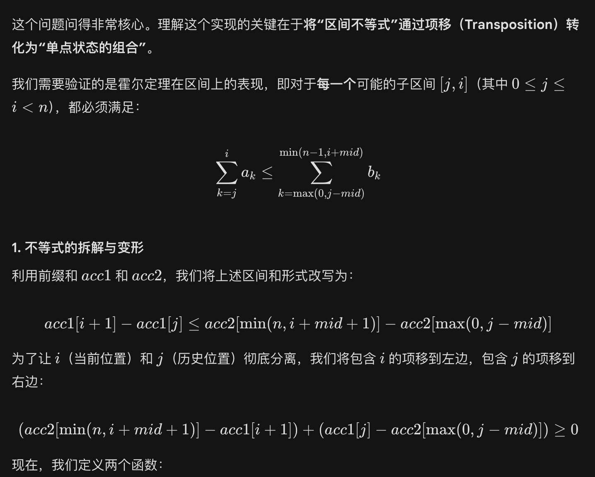
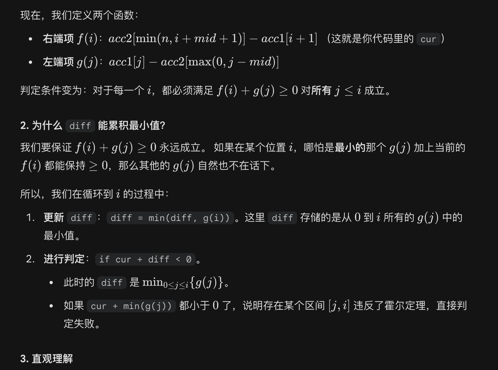
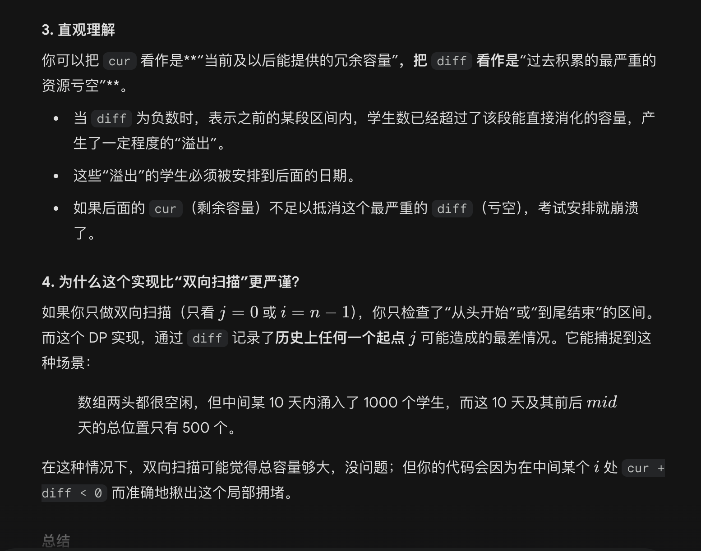
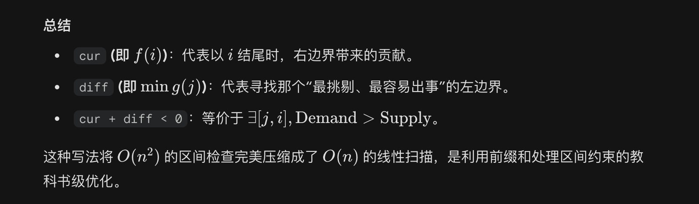

## 不等式变形

这个问题问得非常核心。理解这个实现的关键在于**将“区间不等式”通过项移（Transposition）转化为“单点状态的组合”**。

我们需要验证的是霍尔定理在区间上的表现，即对于**每一个**可能的子区间 （其中 ），都必须满足：

### 1. 不等式的拆解与变形

利用前缀和  和 ，我们将上述区间和形式改写为：

为了让 （当前位置）和 （历史位置）彻底分离，我们将包含  的项移到左边，包含  的项移到右边：

现在，我们定义两个函数：

* **右端项 **： （这就是你代码里的 `cur`）
* **左端项 **：

判定条件变为：对于每一个 ，都必须满足  对**所有**  成立。

### 2. 为什么 `diff` 能累积最小值？

我们要保证  永远成立。
如果在某个位置 ，哪怕是**最小的**那个  加上当前的  都能保持 ，那么其他的  自然也不在话下。

所以，我们在循环到  的过程中：

1. **更新 `diff**`：`diff = min(diff, g(i))`。这里 `diff` 存储的是从  到  所有的  中的最小值。
2. **进行判定**：`if cur + diff < 0`。
* 此时的 `diff` 是 。
* 如果 `cur + min(g(j))` 都小于  了，说明存在某个区间  违反了霍尔定理，直接判定失败。

### 3. 直观理解

你可以把 `cur` 看作是**“当前及以后能提供的冗余容量”**，把 `diff` 看作是**“过去积累的最严重的资源亏空”**。

* 当 `diff` 为负数时，表示之前的某段区间内，学生数已经超过了该段能直接消化的容量，产生了一定程度的“溢出”。
* 这些“溢出”的学生必须被安排到后面的日期。
* 如果后面的 `cur`（剩余容量）不足以抵消这个最严重的 `diff`（亏空），考试安排就崩溃了。

### 4. 为什么这个实现比“双向扫描”更严谨？

如果你只做双向扫描（只看  或 ），你只检查了“从头开始”或“到尾结束”的区间。
而这个 DP 实现，通过 `diff` 记录了**历史上任何一个起点 ** 可能造成的最差情况。它能捕捉到这种场景：

> 数组两头都很空闲，但中间某 10 天内涌入了 1000 个学生，而这 10 天及其前后  天的总位置只有 500 个。

在这种情况下，双向扫描可能觉得总容量够大，没问题；但你的代码会因为在中间某个  处 `cur + diff < 0` 而准确地揪出这个局部拥堵。

### 总结

* **`cur` (即 )**：代表以  结尾时，右边界带来的贡献。
* **`diff` (即 )**：代表寻找那个“最挑剔、最容易出事”的左边界。
* **`cur + diff < 0`**：等价于 。

这种写法将  的区间检查完美压缩成了  的线性扫描，是利用前缀和处理区间约束的教科书级优化。

**你是否想尝试调整一下代码，看看如果把 `diff` 的更新放在 `if` 判定之后，逻辑会发生什么微妙的变化？（这涉及到区间长度是否可以为 0 的问题）**