# 斐波那契矩阵形式 
a = [[1,1],[1,0]]

[矩阵表达](verify.py)

# 初始项不是 1,2 是 A，B 的递推公式
[初始项为 A,B](verify.py)

# 高阶递推 解决 F[n] =F[n-1]**p * F[n-2]**q
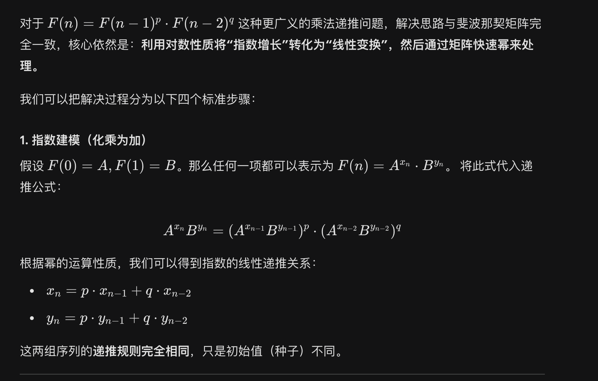
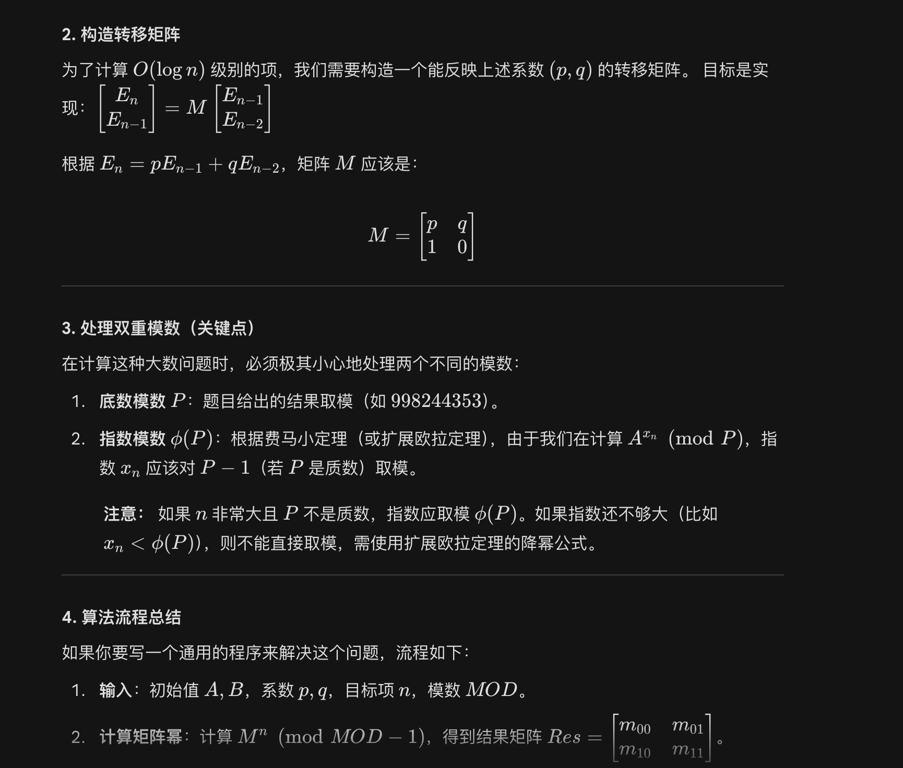
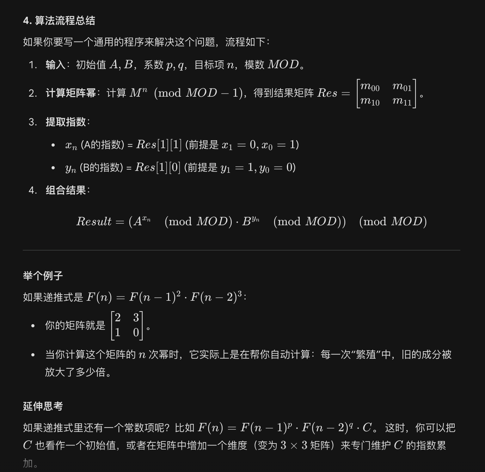

# 三阶递推 解决 F[n] =F[n-1]**p * F[n-2]**q * C 
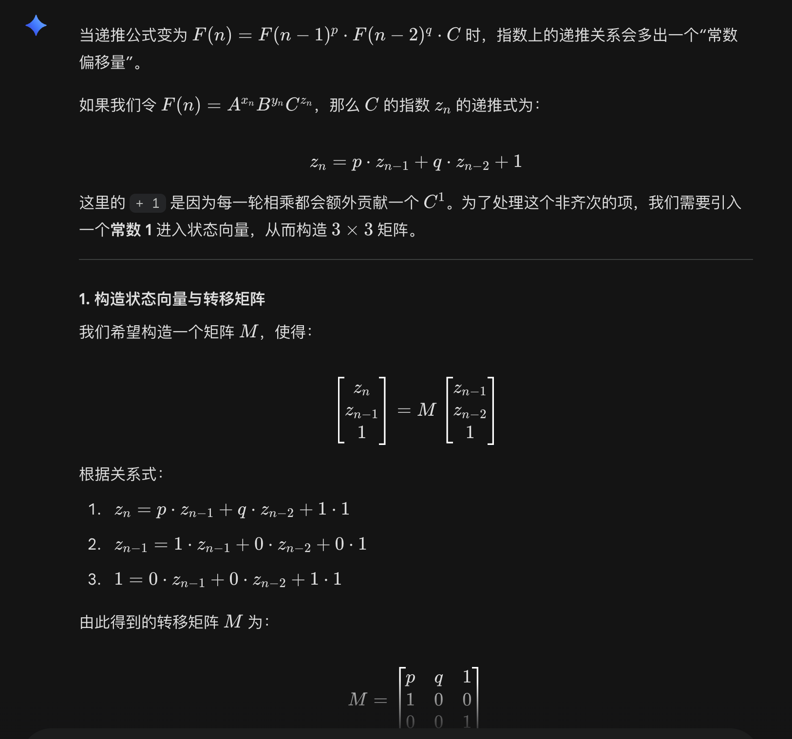
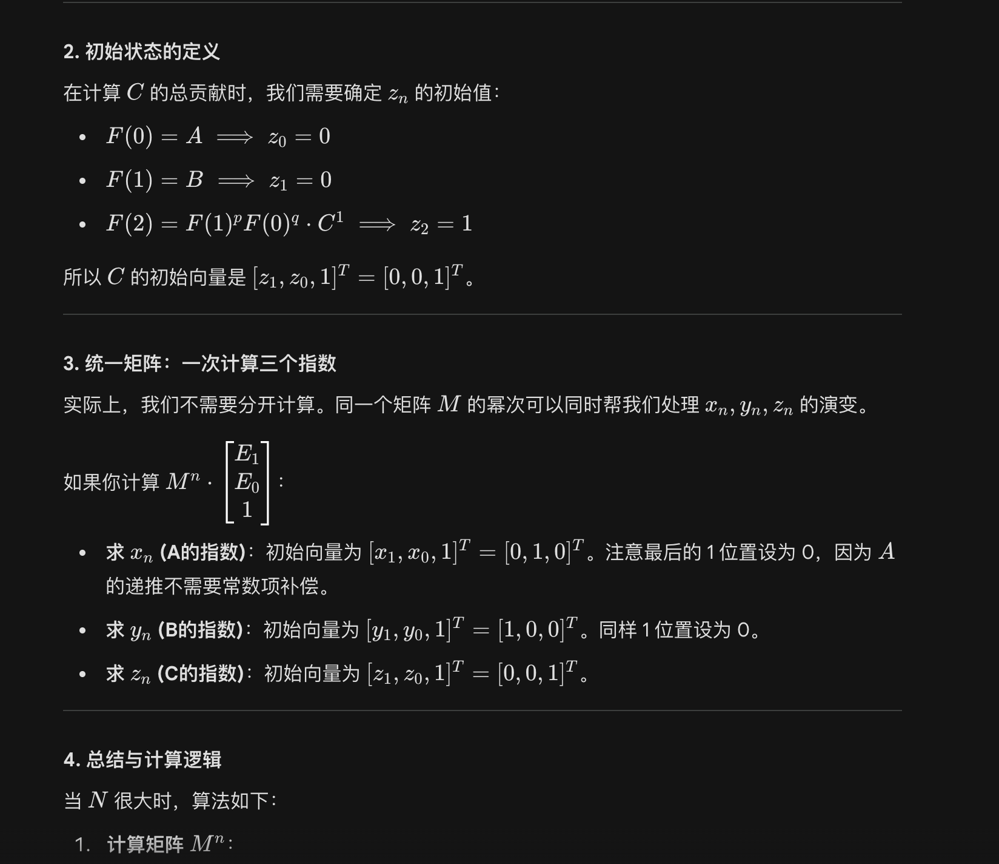
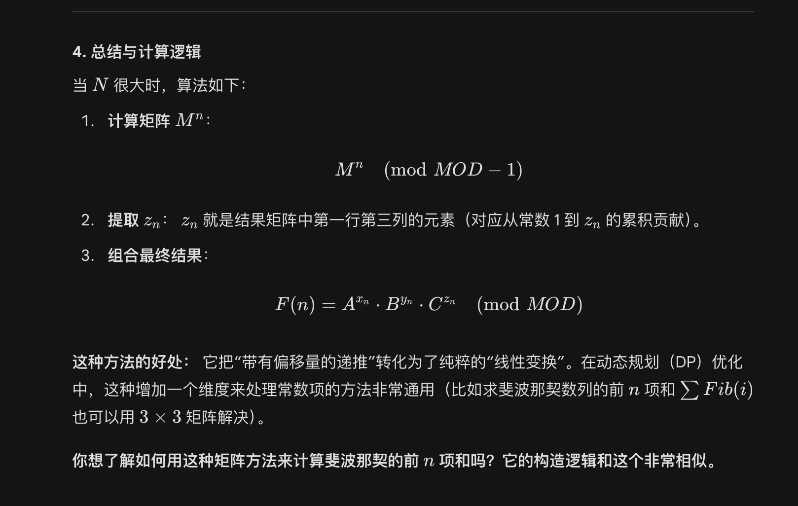

## 三阶递推系数计算
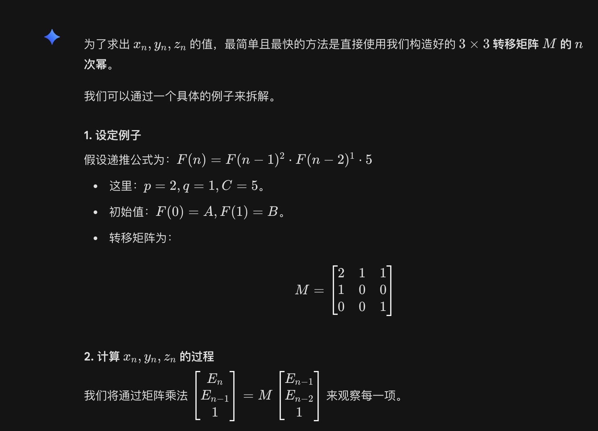
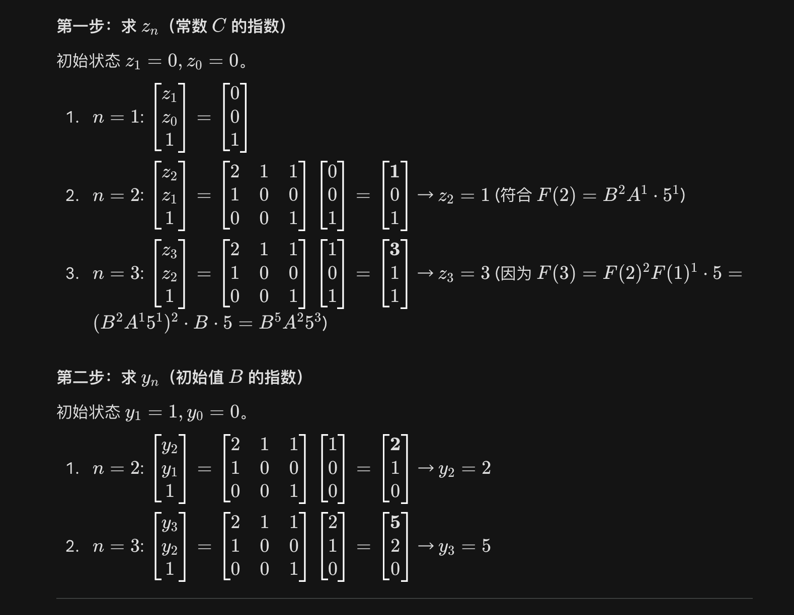
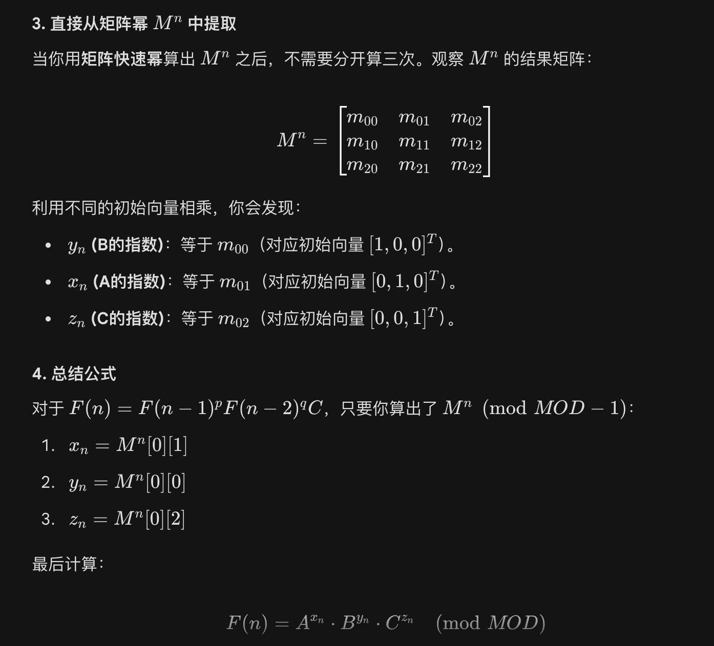
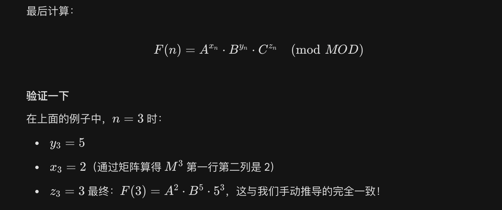

## 系数偏移问题

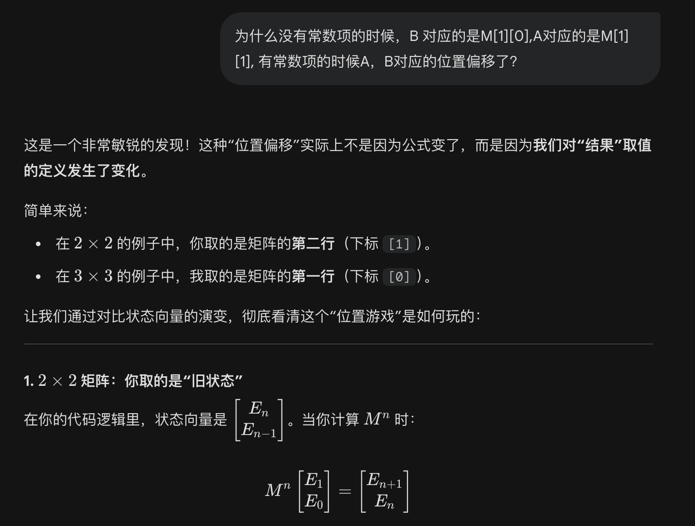
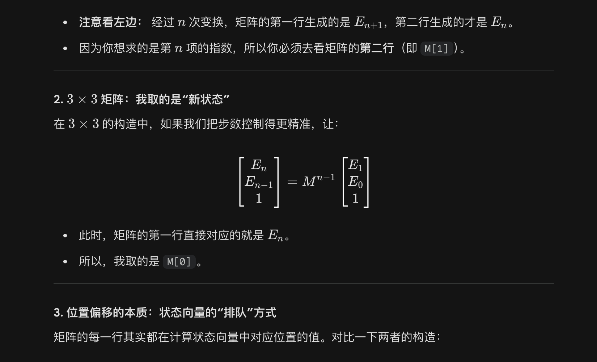
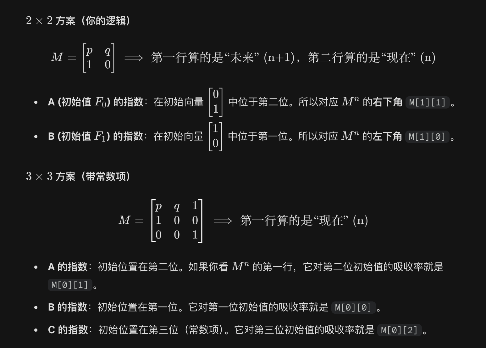
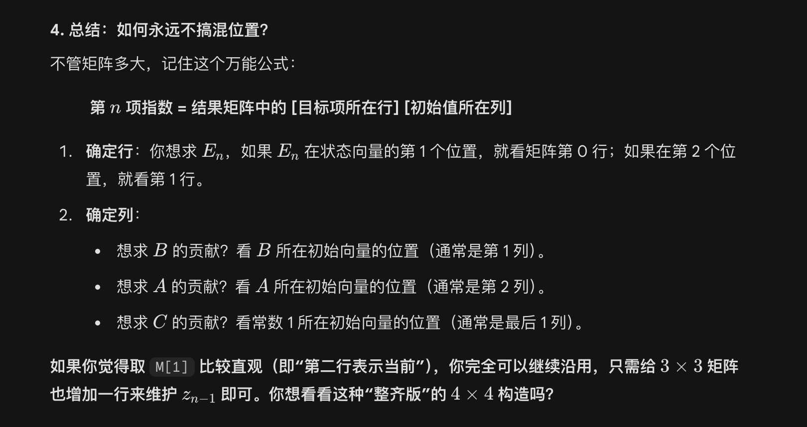

其实很简单，2阶和三阶的系数偏移是因为在计算的时候二阶用的N次方，三阶计算用的是N-1次方，所以三阶用第一行的值，二阶用第二行的值