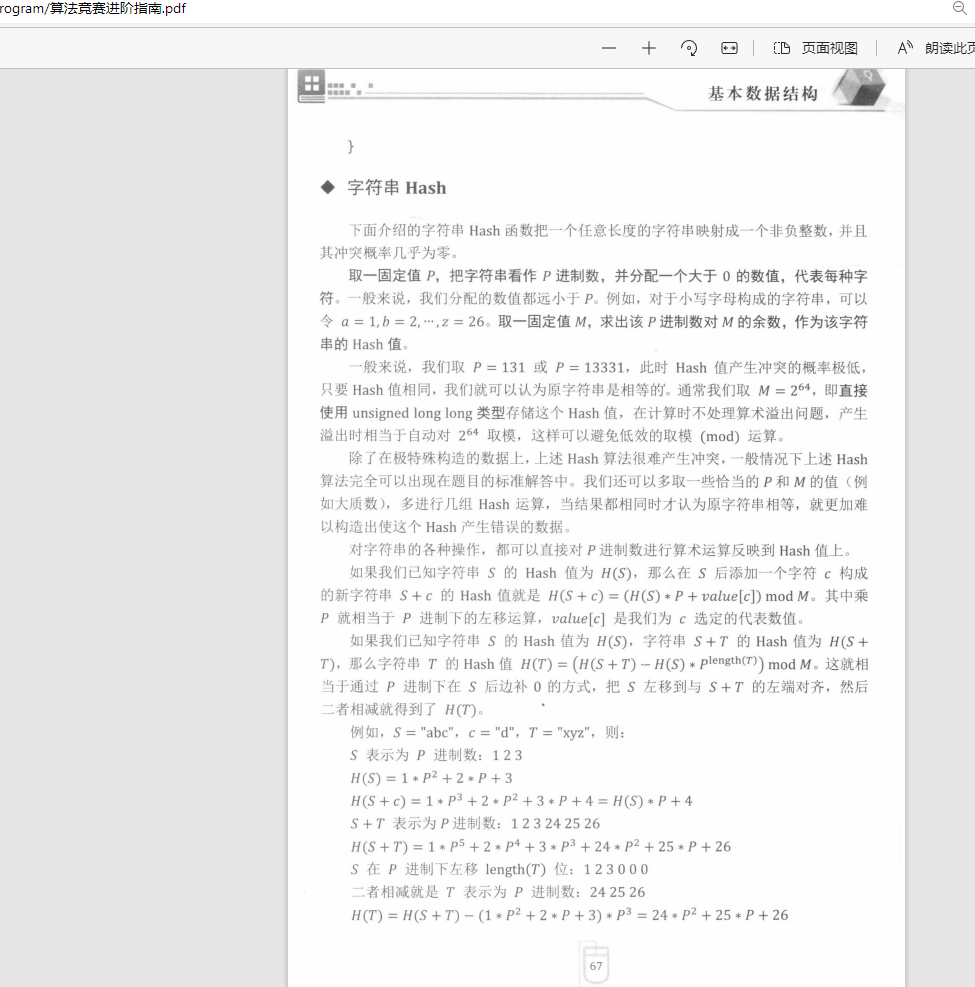

# rolling hash
 https://leetcode-cn.com/problems/longest-duplicate-substring/submissions/

1. rabin-karp method(2 hash)
# https://leetcode-cn.com/problems/longest-duplicate-substring/solution/zui-chang-zhong-fu-zi-chuan-by-leetcode-0i9rd/

2. use good hash key
# use mod =2**64 k =131 or 13331
