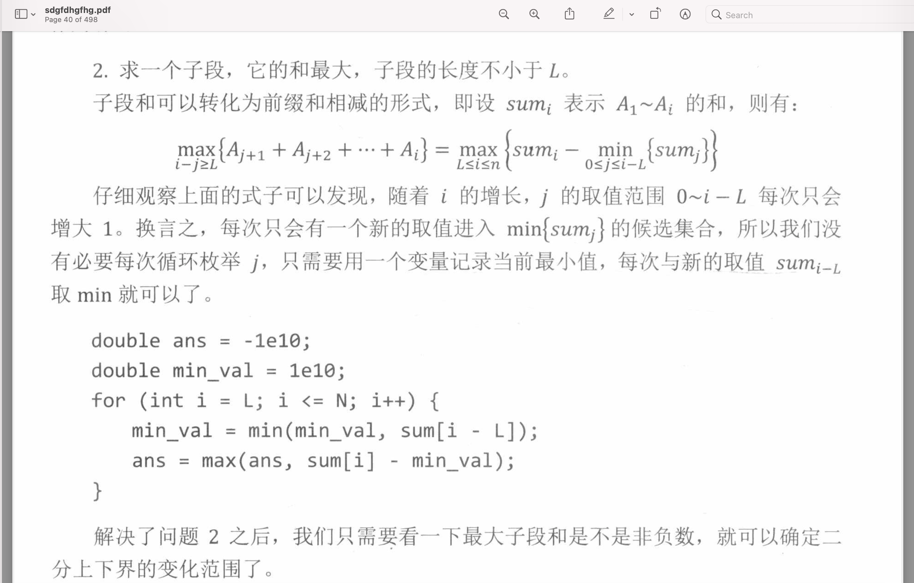

Sub set without duplicate other/90/t2.py https://leetcode.com/submissions/detail/532680686/?from=explore&item_id=3837

substring of bitmask hard/1915/t2.py Number of Wonderful Substrings https://leetcode.com/problems/number-of-wonderful-substrings/

inv function to resolve div operation of a mod value https://leetcode.com/problems/count-ways-to-build-rooms-in-an-ant-colony/discuss/1343768/Python-or-0(N)-or-DP-or-DFS-or-Combinatorics-or-topological-sort-or-Inverse-Modulo 
https://github.com/wisdompeak/LeetCode/tree/master/Template/Inverse_Element  逆元方法
https://github.com/wisdompeak/LeetCode/tree/master/Math/1916.Count-Ways-to-Build-Rooms-in-an-Ant-Colony

Game theory contest/c261/q3 -- https://leetcode.com/problems/stone-game-ix/discuss/1500245/JavaC%2B%2BPython-Easy-and-Concise-6-lines-O(n)

use stack to get lexicographically  order string context/c261/q4 https://leetcode.com/problems/smallest-k-length-subsequence-with-occurrences-of-a-letter/discuss/1500303/Python3-greedy-via-stack

求长度为m的窗口的最大值使用栈 https://github.com/wisdompeak/LeetCode/blob/master/Deque/1562.Find-Latest-Group-of-Size-M/1562.Find-Latest-Group-of-Size-M.cpp

            while (dq.size() > 0 && day[dq.back()] < day[i])
                dq.pop_back();
            while (dq.size() > 0 && i - dq.front() >= m)
                dq.pop_front();
    https://leetcode-cn.com/problems/sliding-window-maximum/

查询线段范围，用dic记录remove操作，用重新入队列的方式pop 不合规的值(question/c239/t4 No.1851 https://leetcode-cn.com/problems/minimum-interval-to-include-each-query/)

# cache
questions/c229 https://leetcode-cn.com/problems/maximum-score-from-performing-multiplication-operations/submissions/
use @functools.lru_cache(None)  will timeout 
use @functools.lru_cache(1024) will pass which set the cache size will resolve timeout issue
use bottom up dp will resolve the issue

# match most
contest/d65/q4 
https://leetcode.com/problems/maximum-number-of-tasks-you-can-assign/discuss/1575980/Python-or-Binary-Search-%2B-Check-Answer-Greedily

best match => binary search => if use strength =>remove best match in target.

# DAG
question/c240/q42.py
https://leetcode-cn.com/problems/largest-color-value-in-a-directed-graph/submissions/

d->b
a->b->c...->1000
e->f->c

计算DAG图不是树的时候，需要用入度为零执行bfs
如果计算对象的值域是有限的时候，可以遍历值域计算出结果

# 能用数字表示map优先使用数组
https://www.youtube.com/watch?v=mjt_YNZzgC8
无向图转有向图。。。

# dp 用queue 记录区间最大值 questions/220/q31.py
https://leetcode-cn.com/problems/jump-game-vi/submissions/

# python reverse int
int(str(l) +str(j) +str(j) +str(l)[::-1]) //contest/268/q4/t4.py https://leetcode-cn.com/contest/weekly-contest-268/problems/sum-of-k-mirror-numbers/

# （NP问题）状态转移DP 可能python不能通过， 用剪枝可以 
https://leetcode-cn.com/problems/find-minimum-time-to-finish-all-jobs/submissions/
https://www.youtube.com/watch?v=vT1nhRyFfNo
question/c223/q43.py
q4.py 用状态压缩时 python 会超时。
q42.py 用dfs加上记忆剪枝 可以通过。
q43.py 把任务分给人时候剪枝新人分配路径
https://leetcode-cn.com/problems/minimum-incompatibility/submissions/

# dic.keys() iterate will throw exception
questions/c218/q2.py
https://leetcode-cn.com/problems/max-number-of-k-sum-pairs/submissions/

# count number of prefix 先計算數字再更新
https://www.youtube.com/watch?v=QiiK-his0IQ
question/c247/q3.py   https://leetcode-cn.com/problems/number-of-wonderful-substrings/submissions/

# 递归树的时候，需要把中间过程存于数组
https://leetcode-cn.com/problems/count-ways-to-build-rooms-in-an-ant-colony/submissions/

# 注意优先队列的排序条件 questions/c243/q3.py https://leetcode-cn.com/problems/process-tasks-using-servers/

# time serious 时间序列图的遍历 用bfs方式 https://leetcode-cn.com/problems/find-all-people-with-secret/submissions/

# random number generation q519 https://leetcode-cn.com/problems/random-flip-matrix/

# 递归调用用self 传数组会使得时间快n倍 https://leetcode-cn.com/problems/make-the-xor-of-all-segments-equal-to-zero/submissions/

# 差分法先定义差分数组记录比较简单 如果数组太大就可以用离散差分值放入heap，或者sortedlist.  https://leetcode-cn.com/problems/minimum-moves-to-make-array-complementary/   
https://www.youtube.com/watch?v=mRvmisDyNs4

# math.pow 和pow在大数的时候会不同，要用pow
print(math.pow(19,19)%1337)
print(pow(19,19)%1337)
https://leetcode-cn.com/problems/super-pow/solution/chao-ji-ci-fang-by-leetcode-solution-ow8j/

# https://leetcode-cn.com/contest/weekly-contest-113/problems/largest-component-size-by-common-factor/
计算公因数的时候，如果只取了sqrt 的prime 需要求得最后的余数（xt）和本身并集  
第二个版本，我们只需要求出sqrt(100000)以内的所有质数Pi，这样预处理的规模就小了很多．但是如果继续按照上面的算法，如何保证得到a的所有质因数Pi并建立联系呢？其实我们只要将a不断除以它在sqrt(100000)以内的所有质因数，如果仍然大于1，那么剩下的必然是它唯一的一个大于sqrt(100000)的质因数．因为任何数不可能含有两个大于sqrt(100000)的质因数的．

pls = getPrimes(2000)
for x in nums:
    xt = x
    for p in pls:
        if xt%p ==0:
            if dsu.find(x) != dsu.find(p):
                dsu.union(x,p)
            while xt %p ==0:
                xt = xt//p
    if xt >1:
        if dsu.find(x) != dsu.find(xt):
            dsu.union(x,xt)

# dfs的时候把消耗品也作为独立的状态 
https://leetcode-cn.com/problems/shortest-path-in-a-grid-with-obstacles-elimination/submissions/  [questions/0-200/c167/q41.py]
visited 如果不好初始化就用set

# 大于一定长度的max average
在binary search 平均值的时候，快速找到一个大于L的区间的和大于0：

https://leetcode-cn.com/problems/shortest-path-in-a-grid-with-obstacles-elimination/submissions/  [questions/0-200/c167/q41.py](https://github.com/wherby/code/blob/master/questions/0-200/c167/q41.py)
visited 如果不好初始化就用set https://github.com/wherby/code/blob/master/questions/0-200/c167/q41.py

# 交换子数组求得最大值 
https://leetcode.com/problems/reverse-subarray-to-maximize-array-value/discuss/950200/3-step-python
https://leetcode-cn.com/contest/biweekly-contest-18/problems/reverse-subarray-to-maximize-array-value/

在求 l,r交换后的增益的时候 这里low_number和high_numer的计算
        for index in range(n - 1):
            
            low_number = min(low_number, max(nums[index], nums[index + 1])) # min of low and the max of the current and next number
            high_number = max(high_number, min(nums[index], nums[index + 1]))
            diff = max(diff, 2 * (high_number - low_number)) # This is explained in ref 1

# 4数区间 https://leetcode-cn.com/submissions/detail/253029658/

# https://oeis.org/  for sequence.

# 判断矩形区域用2维前缀数组 https://leetcode-cn.com/contest/biweekly-contest-69/problems/stamping-the-grid/

# 判断统计的输入是否有重复 https://leetcode-cn.com/contest/weekly-contest-275/problems/count-words-obtained-after-adding-a-letter/

# Dw71

## 初始值設置錯誤
https://leetcode-cn.com/contest/biweekly-contest-71/problems/minimum-difference-in-sums-after-removal-of-elements/
https://leetcode-cn.com/submissions/detail/265052419/
ret = 10*100  以爲是10 **100

## corner case 
https://leetcode-cn.com/contest/biweekly-contest-71/problems/minimum-cost-to-set-cooking-time/
https://leetcode-cn.com/submissions/detail/265051246/
沒有考慮分鐘大於99的情況

## 左右計算，有時可以先計算左邊的最優解，從而得到整個最優(contest/00000c275d69/c279/q4/t41.py)
https://leetcode-cn.com/contest/weekly-contest-279/problems/minimum-time-to-remove-all-cars-containing-illegal-goods/
https://raw.githubusercontent.com/wherby/code/master/contest/00000c275d69/c279/q4/t41.py

# bruteforce

# DP 寻找最小循环
https://leetcode-cn.com/problems/minimum-time-to-finish-the-race/
https://github.com/wherby/code/blob/master/contest/00000c275d69/c282/q4/q41.py

# Get Kth smallest lexicographical number
https://leetcode-cn.com/problems/k-th-smallest-in-lexicographical-order/

# 同余递增

https://leetcode-cn.com/problems/find-servers-that-handled-most-number-of-requests/

# DFS using stack
https://codingcompetitions.withgoogle.com/codejam/round/0000000000876ff1/0000000000a45ef7 
https://raw.githubusercontent.com/wherby/code/master/algorithm/dfs/dfsUsingStack.py

# Encode and decode
https://leetcode-cn.com/contest/weekly-contest-287/problems/encrypt-and-decrypt-strings/
求decode的可能，可以先把可能值encode: contest\00000c275d69\c287\q4\t44.ans.py

# set value for range .\contest\00000c275d69\lc2022c1\q3\
use reverse operation for final value
https://leetcode-cn.com/contest/season/2022-spring/problems/QO5KpG/ 